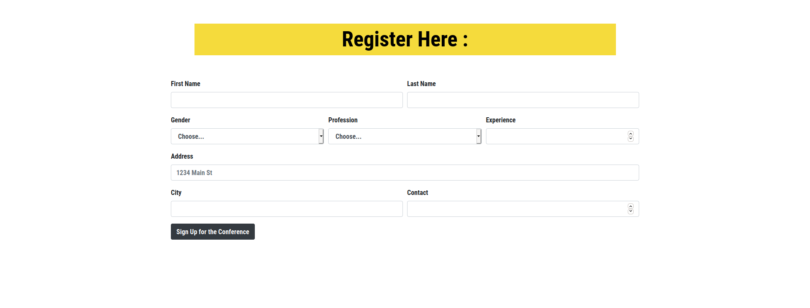
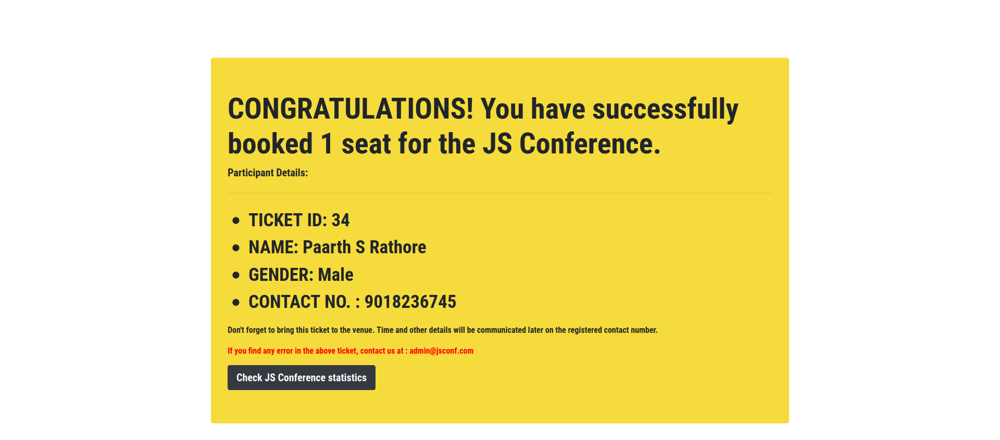
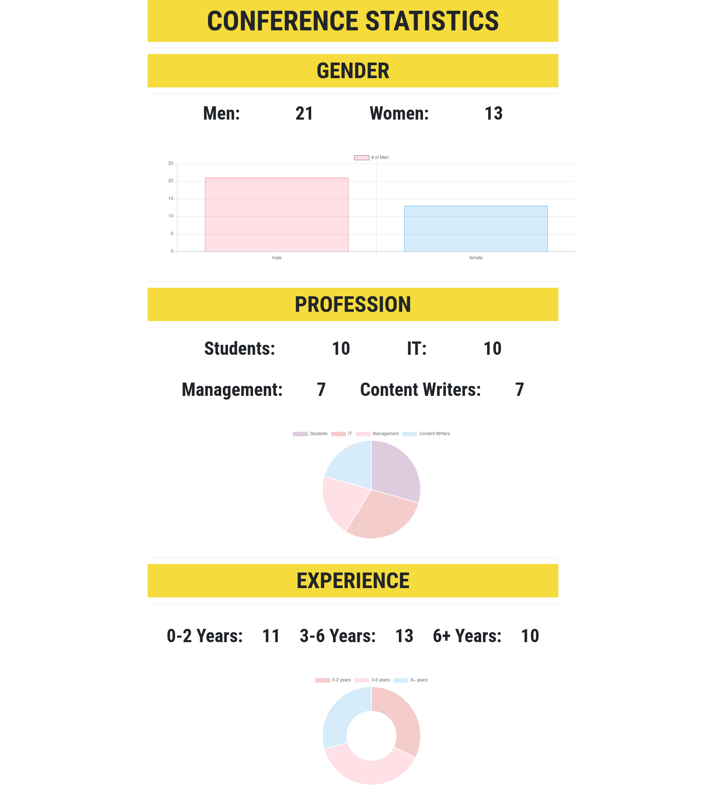

# EventBookingChartJS
Created with CodeSandbox

<h2> Check out the working project here: <a href ="https://calm-earth-52448.herokuapp.com/"> JS CONFERENCE </a> </h2>

This project is hosted on HEROKU

Register yourself using the form provided

Get a system generated ticket for the event

Get insights of conference with the help of chart.js

# Check out codesandbox here -> <a href = "https://codesandbox.io/s/github/RathoreSPaarth/EventBookingChartJS"> Codesandbox </a>

 Raise issues if any :)
